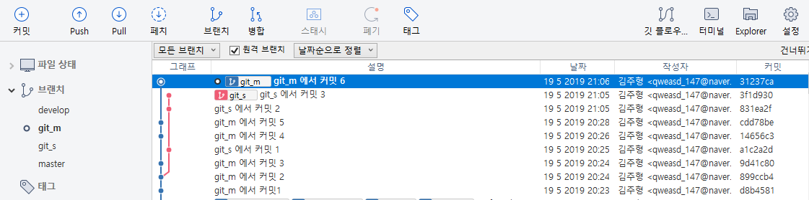
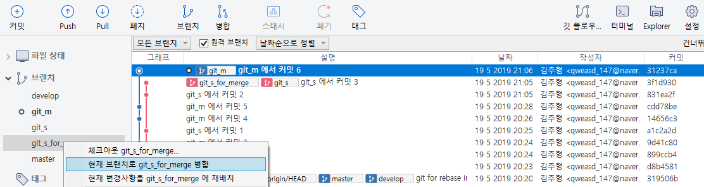
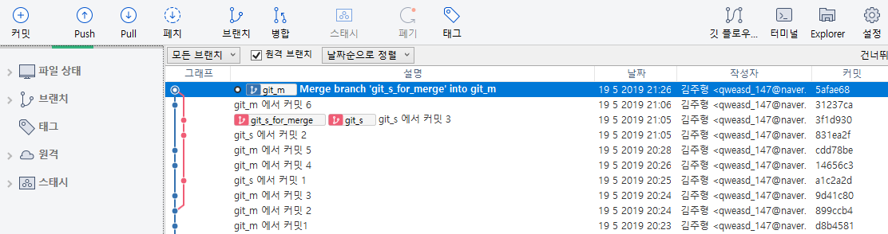
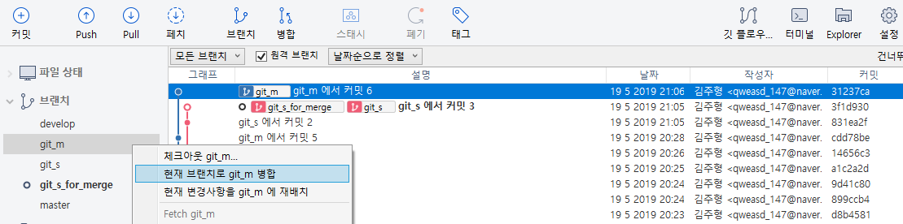
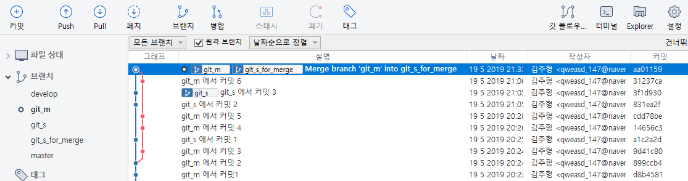
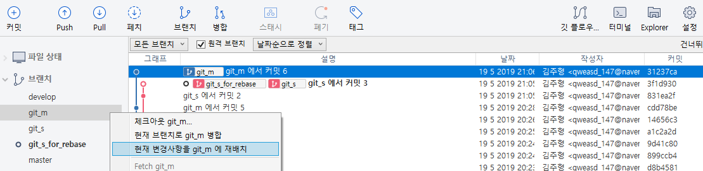
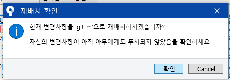
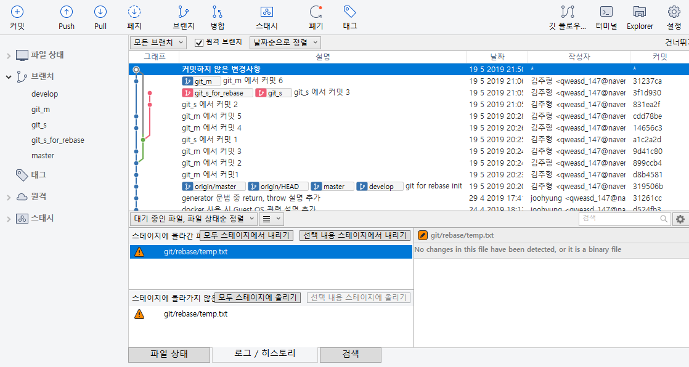
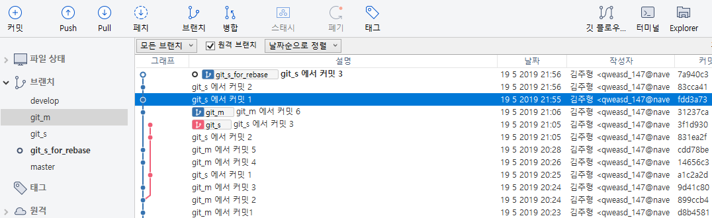

# Rebase

## 1 fast-forward
## 2 rebase를 하는 이유
## 3 merge와 rebase 차이점 및 과정. with source tree
### 3.1 상황 설명을 위한 기본 브랜치 상황

진행 과정을 위한 브랜치 상황 셋팅
* 일반적인 master 브랜치를 가정한 브랜치(git_m)와 기능 추가를 위한 서브 브랜치(git_s)를 추가
* git_m에서 일정 커밋을 쌓은 뒤 git_s 브랜치를 생성 후 각자 적당한 커밋을 추가

### 3.2 merge 방법

rollback시 원할하게 하기위해 `git_s`를 새로운 브랜치 `git_s_for_merge` 브랜치를 추가. `git_s` 브랜치 파일 내용 == `git_s_for_merge` 브랜치 파일 내용

**현재 브랜치를 git_m** 상태에서 원하는 브랜치 우클릭->병합

> 만약 충돌 시, 충돌난 파일을 적절히 수동으로 병합 후, `스테이지에 올라간 파일`에서 해당 파일 우클릭->`충돌해결`->`해결된 것으로 표시` 클릭 후 다시 커밋

#### 주의사항
현재 브랜치가 `git_m`에서 `git_s_for_merge`를 우클릭하여 병합하면 병합 되어진 대상 브랜치(즉 변하는 브랜치)는 `git_m`으로, `git_s_for_merge`는 아무런 변화가 없다.

반대로 현재 브랜치가 `git_s_for_merge`에서 `git_m`를 병합하면 병합 되어진 대상 브랜치(변하는 브랜치)는 `git_s_for_merge`가 된다. 이는 현재 `git_s_for_merge`에서 개발 중, 중간에 마스터 브랜치(`git_m`)로 `push`된 소스 파일들을 `git_s_for_merge`로도 업데이트(동기화) 하는 효과를 준다.

추가로 이 방금 말한 방법대로 `git_m`내용을 `merge` 후 다시 `git_m`에서 `git_s_for_merge`를 `merge`할 수도 있다. 병합 과정중 특별한 일이 없다면 그냥 `git_m`에서 `git_s_for_merge`를 병합한 효과와 같다. 물론 이러한 방법은 history가 헤깔리니까 추천은 x

### 3.3 rebase 방법

rollback시 원할하게 하기위해 `git_s`를 새로운 브랜치 `git_s_for_rebase` 브랜치를 추가. `git_s` 브랜치 파일 내용 == `git_s_for_rebase` 브랜치 파일 내용

**rebase 시 주의!**
rebase는 말 그대로 브랜치의 base를 재정의하는 작업이기 때문에 `git_s_for_rebase`브랜치를 활성화 하고 작업해야됨. 다시 상황 및 목적을 정리하자면

1. 마스터 브랜치(`git_m`)에 새로운 기능을 개발한 브랜치(`git_s_for_rebase`)내용을 추가 하고 싶음
2. history 및 그래프를 깔끔하게 관리하고 싶어, `git_m`와 `git_s_for_rebase`를 fast-forward 상태로 만들고 싶음(`rebase` 사용 목적 1)
3. 그러기 위해선 `git_s_for_rebase`브랜치 base를 `git_m`의 가장 최근 `commit` 된 곳으로 맞추어야됨(`rebase` 사용 목적 2)
4. `git_s_for_rebase`를 수정해야 하는 작업이므로 `git_s_for_rebase`를 활성화 한 상태에서 `git_m`을 선택하여 `rebase`

이러한 이유로 위의 그림대로 rebase를 하려고 하면 경고창이 나타난다. 경고창 말대로 `rebase`는 해당 프로젝트의 git history를 수정하는 작업(base 수정) 하는 작업이므로 해당 브랜치를 누군가가 작업을 하고 있는 중에 `rebase`시 history가 꼬여 귀찮아 진다.

`확인` 버튼을 눌러 rebase를 진행 중, 혹시나마 파일간 충돌이 일어나면 꽤나 귀찮아 진다. 

위 그림은 일부로 충돌을 낸 상황으로 브랜치를 새로 생성 후 `git_m`에서 `temp.txt`를 수정 후 커밋(git_m에서 커밋 5), 이후 `git_s`에서 똑같은 파일을 2번 수정 후 커밋(git_s에서 커밋 2, git_s_에서 커밋 3)을 하여 충돌을 유발시킨 상황 & 이미지 이다.

`rebase` 충돌이 귀찮은 이유는 충돌난 파일을 가지고 있는 커밋들(위 상황에서 git_s에서 커밋 2, git_s_에서 커밋 3)을 모두 적절히 해결을 해주어야 한다. 수정 중 모두 똑같은 내용으로 수정하면 commit history가 이상해 지니까 이 점을 고려해서 적절하게 수정 해주어야 한다.

즉 위 그림에선 (git_s에서 커밋 2)에서 충돌난 파일을 적절히 수정하고 `source tree`의 액션->재배치 계속(또는 `# git rebase --continue` 명령어 입력) 후 (git_s_에서 커밋 3)에서 충돌난 상황을 또 적절히 해결한 후에 다시 액션->재배치 계속(또는 `# git rebase --continue` 명령어 입력)을 입력해야만 아래 그림처럼 정상적으로 `rebase`가 완료된다.

위 그림은 어차피 rollback을 위한 브랜치를 추가한거니까 `git_s`를 신경쓰지 말고(아예 없다고 가정) `git_s_for_rebase`브랜치가 정상적으로 `fast-forward` 상태, 즉 `git_m`의 가장 최근 커밋으로 base가 변경 된 상태를 확인 할 수가 있다. 또한 커밋한 날짜도 변경 된 것도 같이 확인이 가능하다