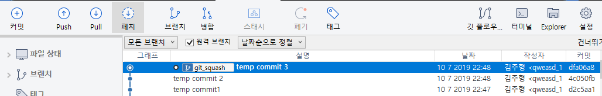
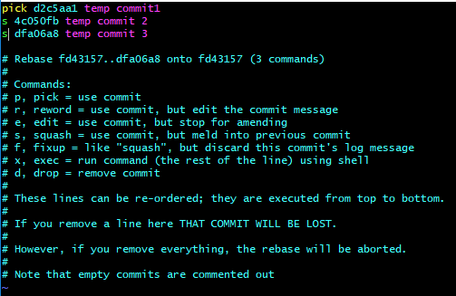
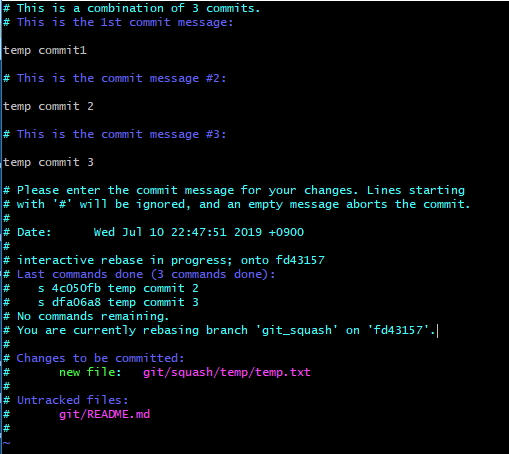
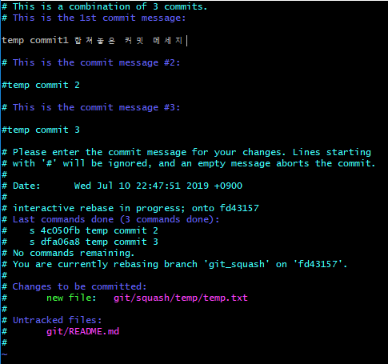
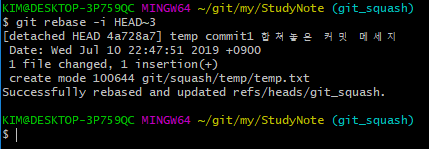
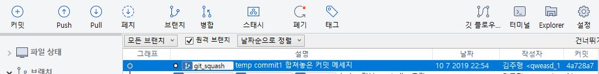

# Squash (rebase)

### 사용목적

커밋을 여러번 한 이후에 나중에 커밋 한 내용을 합치고 싶을 경우가 있을 것이다. 개인적으로 기능 개발 이후에 중간중간 자체 테스트 중 자잘한 버그 수정 등의 작업이 이루어진 케이스가 많다. 이러한 자잘한 버그 수정같은 경우에는 히스토리 관리하기에는 창피하기도 하고... 깃 그래프도 보기 좋지 않아서 종종 이러한 커밋들을 합쳐넣기도 한다.

일단 `squash`로 커밋을 합칠땐 원격지로 `push`여부는 상관없이 합칠 수가 있다. 그래서 일단 로컬에서 합쳐놓고 `push`하면 작업한 내용들이 합쳐져서 올라간다. 근데 만약 원격지로 `push`하지 않고 로컬에서 작업한 것들을 합칠땐 구지 귀찮게 `squash`로 합치진 않고 개인적으로 그냥 `reset`기능에 `mixed`옵션을 줘서 지정된 커밋까지 커밋을 취소하고 작업한다.

**주의** 리눅스에서 많이 사용하는 `vim` 편집기 사용법은 기본적으로 알고 있다는 가정하에 사용

#### case 1. 커밋한 내용들이 원격지로 push 되었을 경우
> `squash`를 사용해서 커밋한 내용들을 합치고 난 후, `push`한다.

#### case 2. 커밋한 내용들이 원격지로 push 까진 안한경우
> `reset`를 사용해서 지정된 커밋으로 되돌리고 소스 수정 후, `push`한다.
```
$ git reset --mixed [커밋 고유 ID]
```

사실 이거나 저거나 고만고만하고 reset이 조금 더 편하긴 하지만, 이번 목적은 `squash`를 사용해서 커밋을 합치는게 목표니까 `reset`기능은 사용하지 않을것이다.

### 사용방법
#### 1. 임의의 브랜치 생성 & 커밋 생성



임의의 브랜치`git_squash` 생성 후, 커밋 3개 (`temp commit 1`, `temp commit 2`, `temp commit 3`)을 초기화한 이미지. 여기서 보여지는 커밋 3개를 한개로 합치는 작업을 할 예정

#### 2. 원하는 커밋 지정

```
$ git rebase -i HEAD~3
```

위의 명령어는 최근(`HEAD`) 커밋부터 3개(`~3`)의 커밋을 `rebase`(history 수정을 위한) 명령어 이다.



그러면 위 이미지 처럼 `vim` 편집기를 바탕으로 오래된 순서대로 지정된 커밋 정보가 나타나는데 합치기를 원하는 커밋들을 `s` 또는 `squash`를 입력하여(이미지에선 `s`) 지정할 수가 있고, 입력 후에 저장&빠져나온다(`wq`).

#### 3. 합쳐진 새로운 커밋 메세지 수정



빠져나오면 합쳐진 커밋 메세지를 수정할 기회를 주는데, 친절하게 사용법도 다 나와있다. `#`을 써서 주석 처리(커밋 메세지 반영x) ignore할 수도 있고, 원하는 메세지를 입력후 저장&빠져나온다(`wq`).





빠져나오면 처리 결과 메세지도 볼 수 있다.



완료 후, git graph를 수정된 내용을 확인 할 수가 있고, 원하는 커밋 3개가 정상적으로 합쳐진 형태(당연히 커밋이 여러번 이루어진 파일은 마지막 커밋을 반영)를 확인 할 수가 있다. 또한 위에서 말한 내용을 다시한번 말하자면, 일단 맨처음 커밋 3개(`temp commit 1`, `temp commit 2`, `temp commit 3`)를 `push`하지 않고 작업하였는데, `push`를 하였다 해도 이 시점에서 `push`하면 원격지에 다 반영된다.

**주의** 보면서 알겠지만 `squash`도 `rebase`작업이다. 즉, git history를 수정하는 작업이므로, 커밋을 합친 브랜치를 다른 사용자와 같이 작업하고 있었다면 history가 꼬여 욕먹을 수 도 있으니 사전에 충분히 공지하고 작업해야한다.